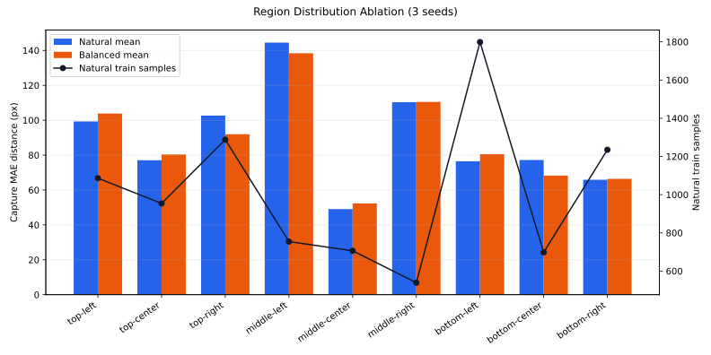

# Data Distribution Ablation

Documented: `2026-04-21`

This diagnostic tests whether the neural gaze model is mainly limited by uneven screen-region training density.

Raw generated reports are local and ignored under `reports/distribution/`. This page keeps the reproducible method and compact result summary.

## Setup

- Dataset: `399` captures / `11,363` frame samples
- Screen: `1440x900`
- Label split: `318` train captures / `81` eval captures
- Model: `spatial_geom 0.5x`
- Parameters: `346,498`
- Training: `20` max epochs, MPS, augmentation on, early stopping patience `4` after epoch `8`
- Seeds: `1337`, `2024`, `4242`

Two training distributions were compared:

- `natural`: the original collector train distribution.
- `region_balanced`: constant-size resampling so each populated 3x3 screen region contributes about the same number of training samples per epoch.

The balanced variant keeps the same total sample count per epoch as the natural run. It changes region weighting; it does not simply give the model more batches.

Command shape:

```bash
python data_distribution_ablation.py \
  --model spatial_geom \
  --param-multiplier 0.5 \
  --epochs 20 \
  --device mps \
  --seed 1337 \
  --output-dir reports/distribution/latest
```

Repeat with `--seed 2024` and `--seed 4242` for the aggregate shown below.

## Result



| Variant | Capture MAE mean | Std | Individual runs |
| --- | ---: | ---: | --- |
| `natural` | `89.2px` | `3.9px` | `89.9`, `84.9`, `92.6` |
| `region_balanced` | `88.1px` | `4.0px` | `88.3`, `92.0`, `83.9` |

Balanced minus natural: `-1.1px`.

That improvement is smaller than seed-to-seed variance, so this is not strong evidence that region balancing should become the default trainer.

## Region Breakdown

| Region | Natural train samples | Eval captures | Natural MAE | Balanced MAE | Delta |
| --- | ---: | ---: | ---: | ---: | ---: |
| `top-left` | `1,086` | `15` | `99.3px` | `103.8px` | `+4.5px` |
| `top-center` | `954` | `8` | `77.1px` | `80.4px` | `+3.3px` |
| `top-right` | `1,288` | `12` | `102.6px` | `92.0px` | `-10.7px` |
| `middle-left` | `754` | `7` | `144.5px` | `138.4px` | `-6.1px` |
| `middle-center` | `706` | `1` | `49.0px` | `52.3px` | `+3.3px` |
| `middle-right` | `539` | `8` | `110.3px` | `110.5px` | `+0.2px` |
| `bottom-left` | `1,799` | `16` | `76.5px` | `80.5px` | `+4.0px` |
| `bottom-center` | `698` | `8` | `77.2px` | `68.3px` | `-9.0px` |
| `bottom-right` | `1,235` | `6` | `65.9px` | `66.4px` | `+0.5px` |

## Interpretation

The hypothesis gets only weak support.

Region-balanced sampling helped a few regions, especially `top-right`, `middle-left`, and `bottom-center`, but hurt or did nothing for others. The net gain was about `1.1px`, which is smaller than the observed `4px` seed-to-seed standard deviation.

The natural run's train-sample-count versus region-error correlation was weak:

- Pearson: about `-0.20`
- Spearman: about `-0.09`

So on label holdout, the simple story "less data in a region means higher error" does not explain the current errors. Some sparse regions are hard, but some dense regions are also easy.

This differs from `region_holdout`. In region holdout, the target region is absent from training, so high error mainly measures spatial extrapolation difficulty. It should not be interpreted as "more data in that held-out region made the model worse."

## Decision

Do not make region-balanced training the default yet.

The better next data move is still session-diverse collection with broad screen coverage. If distribution weighting is revisited, it should be tested on `session_holdout`, not just label holdout, and it should use several seeds because the effect size is currently small.
