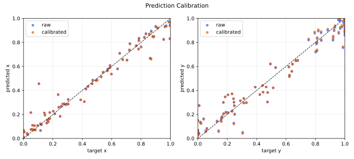
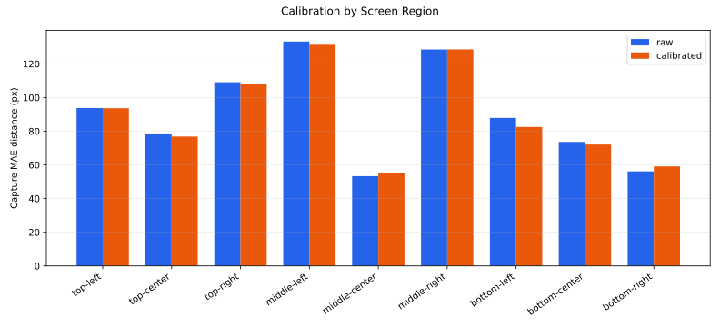

# Prediction Calibration Analysis

Documented: `2026-04-21`

This diagnostic tests whether the current NN model fails near screen edges mainly because its bounded `[0, 1]` sigmoid output compresses predictions toward the center. It is a local checkpoint diagnostic, not a public benchmark.

Raw generated reports are local and ignored under `reports/calibration/`. This page records the command shape and compact result summary. Exact numbers require the same local personalized dataset and checkpoint.

## Setup

- Checkpoint: `models/vision_gaze_spatial_geom.pt`
- Model: `spatial_geom 0.5x`
- Dataset: `399` captures / `11,363` frame samples
- Eval split: `81` collector eval captures
- Screen: `1440x900`
- Device: MPS

Command:

```bash
python prediction_calibration_analysis.py \
  --device mps \
  --output-dir reports/calibration/latest \
  --split-repeats 12
```

## Compression Diagnostic



The model output is bounded by `sigmoid`, so edge compression is plausible. The diagnostic compares capture-level raw predictions against capture targets on the collector eval split.

| Axis | Raw pred-vs-target slope | Intercept | Raw predicted range | Target range |
| --- | ---: | ---: | --- | --- |
| `x` | `0.919` | `0.036` | `0.012-0.973` | `0.000-1.000` |
| `y` | `0.878` | `0.058` | `0.033-0.986` | `0.000-1.000` |

Positive inward bias means predictions are pulled toward screen center.

| Edge group | Inward bias |
| --- | ---: |
| left x | `+37.1px` |
| right x | `+40.7px` |
| top y | `+36.3px` |
| bottom y | `+32.9px` |

There is measurable inward bias, especially at the edges. But the slopes are not collapsed enough to explain the whole error pattern by output scaling alone.

## Calibration Test

Calibrators were fit on train captures, then evaluated on collector eval captures.

| Calibrator | Capture MAE | X MAE | Y MAE | Notes |
| --- | ---: | ---: | ---: | --- |
| `identity` | `94.9px` | `59.9px` | `60.3px` | raw model |
| `linear` | `93.5px` | `60.4px` | `58.0px` | best train-fit eval result |
| `logit_affine` | `104.1px` | `71.9px` | `57.1px` | expands edges, hurts x badly |
| `centered_power` | `94.5px` | `61.2px` | `57.8px` | exponential-style center/edge curve |

A second test repeatedly fit calibration on half of the collector eval captures and tested on the other half. This simulates collecting a post-training calibration set, but each split is smaller.

| Calibrator | Test Capture MAE | X MAE | Y MAE |
| --- | ---: | ---: | ---: |
| `identity` | `90.7px +/- 11.7` | `55.0px +/- 10.6` | `60.1px +/- 5.9` |
| `linear` | `93.0px +/- 10.8` | `58.9px +/- 9.2` | `57.1px +/- 7.1` |
| `logit_affine` | `121.3px +/- 16.2` | `86.8px +/- 15.2` | `67.0px +/- 13.1` |
| `centered_power` | `95.2px +/- 8.6` | `61.8px +/- 8.0` | `58.2px +/- 6.3` |

The exponential-style `centered_power` calibration does not help. The logit-space edge-expanding calibration actively hurts.

## Region Effect



The best train-fit calibrator was `linear`, but it only improved the full eval split by `1.4px`.

| Region | Captures | Raw MAE | Linear-calibrated MAE | Delta |
| --- | ---: | ---: | ---: | ---: |
| `top-left` | `15` | `93.7px` | `93.6px` | `-0.1px` |
| `top-center` | `8` | `78.7px` | `76.8px` | `-1.8px` |
| `top-right` | `12` | `109.1px` | `108.1px` | `-0.9px` |
| `middle-left` | `7` | `133.2px` | `131.9px` | `-1.3px` |
| `middle-center` | `1` | `53.3px` | `54.9px` | `+1.6px` |
| `middle-right` | `8` | `128.5px` | `128.6px` | `+0.0px` |
| `bottom-left` | `16` | `87.9px` | `82.5px` | `-5.4px` |
| `bottom-center` | `8` | `73.6px` | `72.1px` | `-1.6px` |
| `bottom-right` | `6` | `56.2px` | `59.1px` | `+2.9px` |

## Conclusion

There is real inward edge bias, so the intuition was reasonable.

But simple global output calibration is not the main fix. The best global warp improved the eval split by only `1.4px`, and calibration fitted on held-out eval subsets was worse than leaving predictions raw. That means the edge issue is probably not just a smooth scaling problem after the neural net output.

The likely failure mode is more structural:

- edge and corner gaze may not be represented by a clean monotonic output compression curve
- the model may confuse some edge/corner gaze states with nearby interior states
- edge behavior may depend on head pose and eye geometry, so one global `x` curve and one global `y` curve are too blunt

Do not wire in a global exponential or logit edge-expansion curve as the default. If calibration is revisited, test a learned 2D residual calibrator using `(pred_x, pred_y, head pose, eye geometry)` and keep it behind an evaluation gate.
