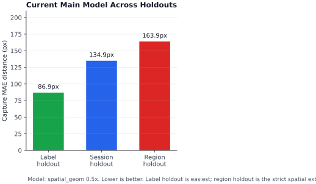
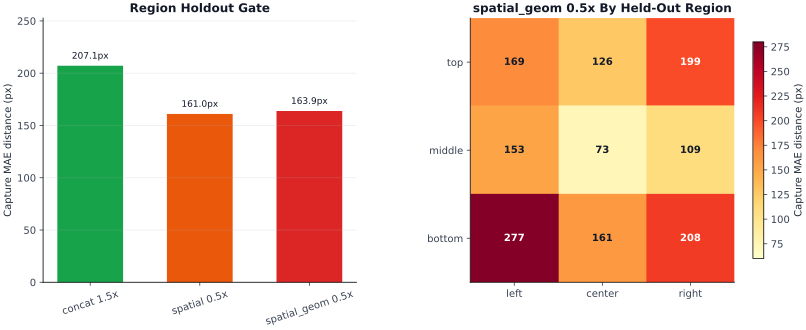

# Local Results Snapshot

This page documents local personalized experiments. It is meant to make the current evidence inspectable without publishing raw biometric-ish data or local checkpoints.

The numbers below are not a public benchmark. They are local result snapshots from one user, one screen/camera setup, and ignored local artifacts.

Documented: `2026-04-19`; updated with data-distribution and prediction-calibration diagnostics on `2026-04-21`.

## How To Read This Page

- Main robustness evidence: `session_holdout`. Cite this first when discussing whether the current model generalizes beyond the specific recording session it trained on.
- Internal model filtering: `label_holdout`. Use this for fast architecture comparisons, not as the main robustness claim.
- Spatial extrapolation stress test: `region_holdout`. Use this to check whether a model collapses when a screen region is absent from training.
- Reproducibility boundary: raw sessions, trained checkpoints, and generated reports are ignored by git. The documented numbers cannot be exactly reproduced from the public repo alone.

## Dataset

Primary result snapshot:

- Screen: `1440x900`
- Sessions: `22`
- Captures: `387`
- Frame samples: `11,018`
- Collection style: manual target placement, 1-second capture windows, aligned eye crops plus MediaPipe face/head features

Later diagnostics on this page use a compatible newer local dataset snapshot with `399` captures and `11,363` frame samples. Those sections are labeled separately. The difference is ordinary local data growth, not a public dataset revision.

## Metrics

- `capture_mae_distance_px`: mean Euclidean pixel error after aggregating frame predictions within each capture.
- `capture_mae_x_px` / `capture_mae_y_px`: absolute pixel error by axis after capture aggregation.
- `label_holdout`: train/eval split from collector labels. Useful for fast architecture filtering. Easier than deployment because train and eval captures can come from similar sessions.
- `session_holdout`: leave-session-out evaluation. This is the main robustness metric because it tests generalization across collection sessions.
- `region_holdout`: leave-screen-region-out evaluation. This tests extrapolation to screen regions that are absent from training.

## Current Holdout Summary



`spatial_geom 0.5x` is the current selected live model line. The selection is based on the completed local comparisons, especially the focused `session_holdout` run. The `label_holdout` result explains why it was promoted for deeper checks; the `region_holdout` result shows that spatial extrapolation is still harder.

| Holdout | Model | Capture MAE |
| --- | --- | ---: |
| `label_holdout` | `spatial_geom 0.5x` | `86.9px` |
| `session_holdout` | `spatial_geom 0.5x` | `134.9px` |
| `region_holdout` | `spatial_geom 0.5x` | `163.9px` |

## Current Main Result

`spatial_geom 0.5x` is the current main model line.

- Architecture: spatial eye-crop CNN preserving final feature grids, plus head/face features, plus engineered eye-geometry scalars.
- Parameters: `346,498`
- Strict metric: `session_holdout`
- Result: `134.9px` capture MAE distance
- Axis MAE: `84.4px x / 84.5px y`
- Average fold size: `369.4` train captures / `17.6` eval captures
- Source report: ignored local file `reports/scaling/session_holdout_spatial_geom/summary.json`

Interpretation: this is the main robustness result in the repo today. It is still local and personalized, but it is stricter than label holdout because whole sessions are excluded from training.

Command shape:

```bash
python scaling_experiments.py \
  --device mps \
  --output-dir reports/scaling/session_holdout_spatial_geom \
  --mode session_holdout \
  --models spatial_geom \
  --sweeps parameters \
  --param-multipliers 0.5 \
  --epochs 20
```

## Architecture Sweep

The dense architecture sweep used `label_holdout` for speed. Treat this as internal model filtering, not the main robustness result.

| Model | Lowest Local Capture MAE | Spec |
| --- | ---: | --- |
| `spatial_geom` | `86.9px` | `param_multiplier=0.50` |
| `spatial` | `92.7px` | `param_multiplier=0.50` |
| `concat` | `120.6px` | `param_multiplier=1.50` |
| `attn` | `128.5px` | `param_multiplier=1.25` |
| `vit` | `141.3px` | `param_multiplier=0.50` |

Interpretation: preserving spatial layout in the eye-crop CNN is the strongest observed architecture change in the local label-holdout sweep. The attention and tiny patch-transformer lines were not competitive in this comparison.

## Region Holdout Gate



Focused `region_holdout` runs were added for the current finalists. Each point used the same 9 held-out screen regions, `20` max epochs, and early stopping with patience `4` after epoch `8`.

| Model | Spec | Params | Region Capture MAE | Axis MAE |
| --- | --- | ---: | ---: | --- |
| `spatial` | `0.5x` | `342,466` | `161.0px` | `98.4px x / 106.3px y` |
| `spatial_geom` | `0.5x` | `346,498` | `163.9px` | `97.7px x / 110.8px y` |
| `concat` | `1.5x` | `453,202` | `207.1px` | `135.4px x / 126.0px y` |

Interpretation:
- The spatial CNN family clearly beats the older average-pooled concat CNN on region holdout.
- `spatial` is slightly better than `spatial_geom` overall on this gate, but the gap is small.
- `spatial_geom` is better on the hardest `bottom-left` fold, while `spatial` is better on several middle/bottom-center folds.
- Region holdout should stay as a promotion gate for any future main model, but it is too expensive for every broad sweep.

Region fold results for `spatial_geom 0.5x`:

| Held-out region | Capture MAE |
| --- | ---: |
| `top-left` | `169.1px` |
| `top-center` | `126.2px` |
| `top-right` | `198.6px` |
| `middle-left` | `152.6px` |
| `middle-center` | `73.4px` |
| `middle-right` | `109.0px` |
| `bottom-left` | `277.3px` |
| `bottom-center` | `160.8px` |
| `bottom-right` | `207.7px` |

Command shape:

```bash
python scaling_experiments.py \
  --device mps \
  --output-dir reports/scaling/region_holdout_spatial_geom_gate \
  --mode region_holdout \
  --models spatial_geom \
  --sweeps parameters \
  --param-multipliers 0.5 \
  --epochs 20 \
  --early-stopping-patience 4 \
  --early-stopping-min-epochs 8
```

## Data Distribution Check

Diagnostic details: [data_distribution.md](data_distribution.md). This check used the newer `399`-capture local dataset snapshot.

A 3-seed label-holdout ablation tested the hypothesis that uneven screen-region training density is the main current bottleneck. The test compared the natural collector distribution against a constant-size region-balanced resampling setup for `spatial_geom 0.5x`.

| Variant | Capture MAE Mean | Std |
| --- | ---: | ---: |
| `natural` | `89.2px` | `3.9px` |
| `region_balanced` | `88.1px` | `4.0px` |

Interpretation: region balancing produced only a `1.1px` mean gain, smaller than seed-to-seed variance. Do not make balanced training the default yet; keep collecting session-diverse data with broad screen coverage.

## Prediction Calibration Check

Diagnostic details: [prediction_calibration.md](prediction_calibration.md). This check used the newer `399`-capture local dataset snapshot and the local `spatial_geom 0.5x` checkpoint.

This tested whether edge failures are mostly caused by the sigmoid-bounded NN output compressing predictions toward the center. Raw predictions do show inward edge bias:

| Edge group | Inward bias |
| --- | ---: |
| left x | `+37.1px` |
| right x | `+40.7px` |
| top y | `+36.3px` |
| bottom y | `+32.9px` |

However, simple global calibration did not solve it. The best train-fit calibrator improved eval capture MAE by only `1.4px`, and repeated eval calibration/test splits were worse than leaving predictions raw.

Interpretation: do not wire in a global exponential/logit edge-expansion curve as the default. The edge issue is probably not just output scaling; it likely depends on signal ambiguity, head pose, eye geometry, and corner-specific behavior.

## Live Checkpoint

The current local live checkpoint is trained as `spatial_geom 0.5x`. This section describes the local runtime artifact, not a public checkpoint.

- Train samples: `8,803`
- Eval samples: `2,215`
- Epochs: `20`
- Device: `mps`
- Random split eval: `61.5px x / 61.9px y`
- Source metadata: ignored local file `models/vision_gaze_spatial_geom.json`

The random split trainer eval is useful for checking that training did not fail. It is easier than `session_holdout` and should not be cited as the main quality estimate.

Command:

```bash
python train_vision_model.py --model spatial_geom --param-multiplier 0.5 --epochs 20 --device mps
```

## Caveats

- These are single-machine, local-user results, not a public benchmark.
- Raw data and checkpoints are not committed, so the numbers cannot be exactly reproduced from this repo alone.
- `label_holdout` can overstate practical quality because train and eval captures may be from similar sessions.
- `session_holdout` is stricter, but fold sizes are imbalanced because sessions have different amounts of captured data.
- `region_holdout` is intentionally strict and can overstate difficulty for regions with sparse or unusual local data.
- This project does not currently claim SOTA webcam gaze tracking. The current goal is a usable personalized webcam-only cursor prototype.
